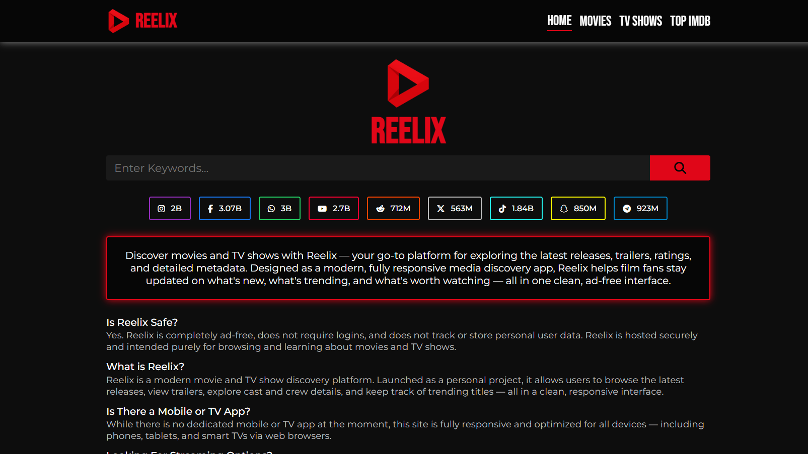

# Reelix 2

## Description

Reelix 2 is a modern, Next.js-powered web application for discovering movies and TV shows using live data from The Movie Database (TMDB) API. It offers a cinematic, intuitive experience for exploring new releases, top-rated titles, and detailed metadata including trailers, cast, directors, genres, and countries.

- **Problem:** Many movie and TV show discovery platforms suffer from cluttered interfaces, limited filtering options, and poor performance. Users struggle to find content that matches their preferences efficiently.

- **Solution:** Reelix 2 provides a clean, responsive UI focused on discoverability and speed. Built with Next.js for optimal SEO and performance, it features server-side rendering, optimized image loading, and seamless client-side navigation. The platform offers powerful filtering by genre, year, and country, along with comprehensive search functionality.

- **Methodology:** The application follows a component-based architecture with Next.js App Router. It leverages server-side rendering for improved SEO, Next.js Image optimization for faster load times, and client components for interactive features. The modular design ensures maintainability and scalability.

**Live Demo:** [Link to Deployed Application]([Link])

## Table of Contents

- [Features](#features)
- [Mock Up](#mock-up)
- [Technology Stack](#technology-stack)

## Features

- **Advanced Filtering System:** Users can filter movies and TV shows by genre, year, and country with real-time URL parameter updates for shareable filtered views.

- **Comprehensive Search:** Powerful search functionality that queries both movies and TV shows simultaneously, intelligently selecting the best match based on vote counts.

- **Top IMDB Ratings:** Dedicated page showcasing the highest-rated movies from TMDB, with detailed metadata and certification information.

- **Detailed Media Pages:** Each movie or TV show features a comprehensive detail page with poster, backdrop banner, trailer links, cast, crew, genres, ratings, and runtime information.

- **Responsive Design:** Fully responsive layout optimized for desktops, tablets, smartphones, and smart TVs, ensuring a consistent experience across all devices.

- **SEO Optimized:** Built with Next.js for optimal search engine optimization, including proper metadata, semantic HTML, and server-side rendering.

- **Performance Optimized:** Leverages Next.js Image component for optimized image loading, font optimization, and efficient code splitting.

## Mock Up

The following images demonstrate the web application&apos;s appearance and functionality:

## Technology Stack

**Frontend:**

- **Styling:** CSS Modules for scoped, maintainable component styling
- **Frameworks/Libraries:** Next.js 16 (App Router), React 19
- **Font Optimization:** Next.js Font Optimization (Bebas Neue, Montserrat)

**Backend:**

- **Runtime:** Node.js
- **Framework:** Next.js (Server-Side Rendering, API Routes)

**Other Technologies:**

- **API Integration:** The Movie Database (TMDB) API for real-time media data
- **Image Optimization:** Next.js Image component for optimized image loading
- **Environment Variables:** Next.js environment variable management (NEXT_PUBLIC_*)
- **Deployment:** Optimized for Vercel, Netlify, or similar Next.js-compatible platforms
